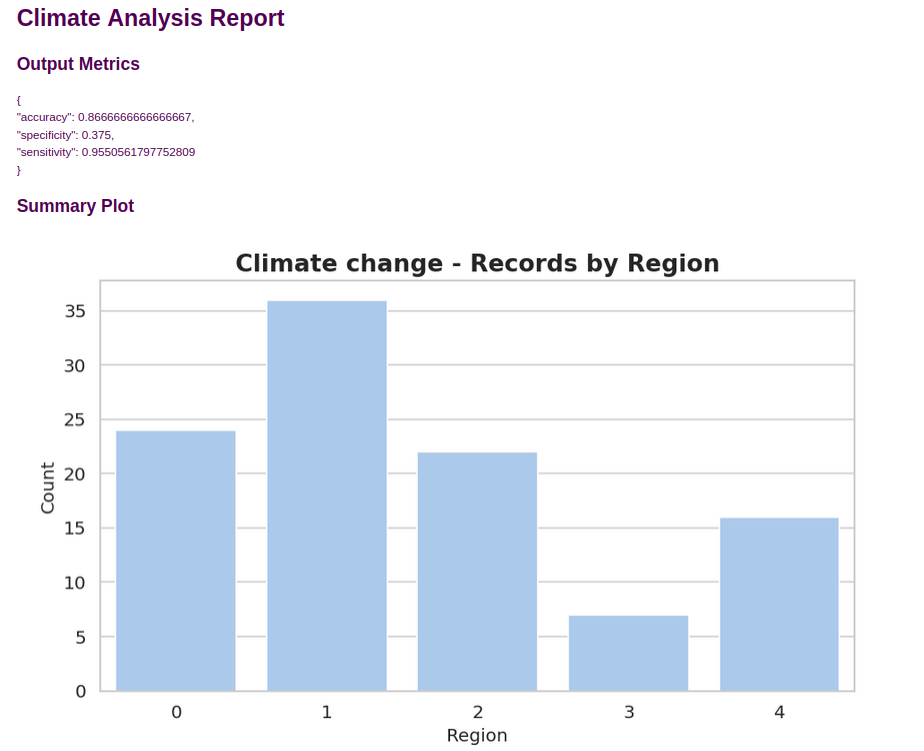

# Climate Analysis ML Pipeline
### by Adriano A. Santos

[](https://www.python.org/)
[](https://github.com/<your-username>/<your-repo>/actions/workflows/climate-analysis.yml)
[](https://cml.dev/)
[](https://www.research-collection.ethz.ch/entities/researchdata/160b68a0-cbfb-4b11-900c-3d144f41eb07)

---

## Overview

This repository is a **tutorial for CI/CD applied to Machine Learning projects**, demonstrating a full pipeline:

- Download dataset
- Preprocess data
- Train a model
- Generate metrics and summary plots
- Publish results automatically on Pull Requests via CML

It uses **Python**, **Hydra** for configuration, **scikit-learn** for modeling, and **GitHub Actions + CML** for CI/CD automation.

---

## Project Structure

```
├── README.md
├── requirements.txt
├── src
│ ├── config
│ │ └── config.yaml # Experiment configuration
│ ├── dataset_preprocessing.py
│ ├── get_dataset.py
│ └── train.py
```


- **get_dataset.py** – Downloads the dataset from the URL specified in `config.yaml`.  
- **dataset_preprocessing.py** – Preprocesses the dataset: drops irrelevant columns and encodes categorical features.  
- **train.py** – Trains a logistic regression model, calculates metrics, and generates a summary plot.  
- **config/config.yaml** – Stores experiment parameters (dataset URLs, file paths, experiment name, etc.).

---

## Dataset

The dataset is publicly available from ETH Zurich:

**Dataset authors:** Cordelia Sophie Kreft, Robert Huber, David Johannes Wüpper, Robert Finger

[Paper](https://www.sciencedirect.com/science/article/pii/S2352340920303048)
[Download Dataset](https://www.research-collection.ethz.ch/entities/researchdata/160b68a0-cbfb-4b11-900c-3d144f41eb07)


Files used in the pipeline:

- `data/dataset.csv` – Original dataset  
- `data/dataset_preprocessed.csv` – Preprocessed dataset

---

## Requirements

- Python 3.9+
- pip

Install dependencies:

```bash
pip install -r requirements.txt
```

## Running the Pipeline Locally

1. Download the dataset

```bash 
python src/get_dataset.py
```

2. Preprocess the dataset
```bash
python src/dataset_preprocessing.py
```

3. Train the model and generate metrics
```bash
python src/train.py
```

Outputs:

* **output_metrics.json** – Model evaluation metrics (accuracy, sensitivity, specificity)
* **summary_plot.png** – Summary plot of records by region



## CI/CD Pipeline

The GitHub Actions workflow (.github/workflows/climate-analysis.yml) automates:

1. Checkout code
2. Install dependencies
3. Download dataset
4. Preprocess data
5. Train and evaluate the model
6. Generate metrics and plots
7. Publish a PR comment with results via CML

* Metrics and plots are automatically posted in Pull Requests for easy review.

## Hydra Configuration

All experiment parameters are defined in **config/config.yaml**:

```yaml
experiment:
  name: "Climate change"
  version: "1.0.0"
  description: "Modeling Swiss farmers' attitudes toward climate change."
  dataset_url: "<DATASET_URL>"
  dataset_folder: "data"
  dataset_file_path: "data/dataset.csv"
  dataset_file_preprocessed: "data/dataset_preprocessed.csv"
```

## Logging

* The pipeline uses Python logging to track progress:

```bash
2025-09-20 12:34:56 - INFO - Loading dataset from data/dataset.csv
2025-09-20 12:34:57 - INFO - Dropping features: [...]
2025-09-20 12:34:58 - INFO - Encoding categorical columns: [...]
2025-09-20 12:34:59 - INFO - Metrics saved to output_metrics.json: {...}
```